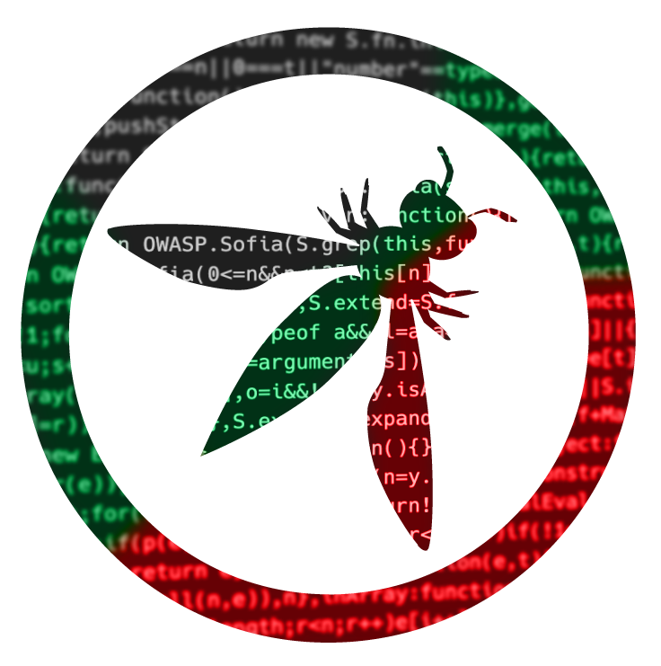

# OWASP Sofia Chapter

## Добре дошли

Ние сме отдадена общност от ентусиасти, професионалисти и експерти в областта на киберсигурността, посветени на подобряването на сигурността на софтуера и технологиите. Като част от глобалната [OWASP Foundation](https://owasp.org/), нашата мисия е да популяризираме най-добрите практики в софтуерната сигурност, да насърчаваме сътрудничеството и да помагаме индивидите и организациите да се защитават срещу кибер заплахи.

Присъединете се към нас в нашите усилия да направим дигиталния свят по-сигурен чрез образование, осведоменост и иновативни решения за сигурност.

## Welcome

We are a dedicated community of cybersecurity enthusiasts, professionals, and experts committed to improving the security of software and technology. As part of the global [OWASP Foundation](https://owasp.org/), our mission is to promote best practices in software security, foster collaboration, and empower individuals and organizations to defend against cyber threats.

Join us in our efforts to make the digital world safer through education, awareness, and innovative security solutions. Whether you’re a seasoned expert or just beginning your journey, there’s a place for you in our community.

If you want to **do a talk** or **sponsor** us, feel free to reach out. All realative information can be found in the [about](#about) page.

If you want to visit our **meetups**, you can check them out below.

## Next Event



## Propose a talk

We're always open for new speakers that would like to share their knowledge and experience about Web Application Security. Please use our [Sessionize](https://sessionize.com/owasp-sofia/) page to submit your talk.
