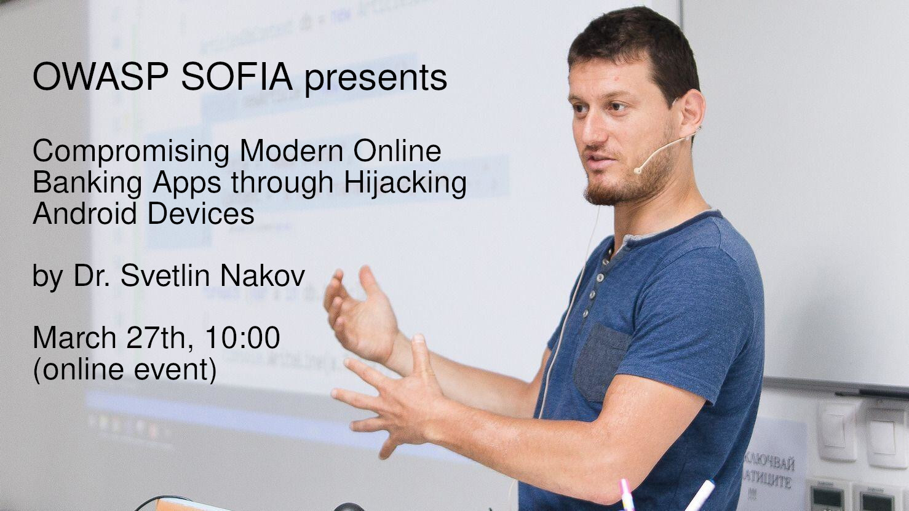

---

layout: col-sidebar
title: OWASP Sofia Chapter
tags: sofia bulgaria

region: Europe
meetup-group: OWASP-Sofia-Chapter
country: Bulgaria
postal-code: 

---

This is the page of the OWASP Sofia Chapter. An OWASP Chapter is like a user group. We do events, discuss topics.

If you'd like to be a **part of our community**, want to **do a talk** or **sponsor** us, check out the [about](#about) page.

All our resources are located [here](#resources).

## Upcoming Events

Generally for **future events** and attending check the [meetup](https://www.meetup.com/OWASP-Sofia-Chapter/) page.

### Svetlin Nakov - Compromising Modern Online Banking Apps through Hijacking Android Devices

(The talk will be in Bulgarian)

**Live Demo: Compromising Modern Online Banking Apps through Hijacking Android Devices**

In this talk Dr. Svetlin Nakov will explain and demonstrate how easily a 10-years old child can gain full control over modern European online banking apps, through hijacking an Android mobile phone, using trivial remote administration tools and screen recording apps from the official Android app store. The speaker will demonstrate why online banking should not rely for the multi-factor authentication on a single connected device. Finally, the speaker will give recommendations for fixing the security in online banking systems.

Dr. Svetlin Nakov (https://nakov.com) is a passionate software engineer, inspirational technical trainer and tech entrepreneur, with 20 years of experience in a broad range of programming languages, software technologies and platforms, applied cryptography and cybersecurity. He is an author of the "Practical Cryptography for Developers" book (https://cryptobook.nakov.com). Svetlin is co-founder of several highly successful tech startups and non-profit organizations. Currently, he is innovation and inspiration manager at SoftUni (https://softuni.org) - the largest tech education provider in South-Eastern Europe.

\[BG\]
**Демонстрация: компрометиране на онлайн банкиране чрез отвличане на Android телефон**

В тази демонстрация на живо д-р Светлин Наков ще обясни и демонстрира колко лесно 10-годишно дете може да получи пълен контрол над съвременните европейски приложения за онлайн банкиране, чрез отвличане на мобилен телефон с Android, използвайки тривиални инструменти за отдалечено администриране и приложения за запис на екрана от Android app store. Лекторът ще демонстрира защо онлайн банкирането не трябва да разчита на многофакторното удостоверяване на единично свързано устройство. Накрая ще бъдат дадени препоръки за подобряване на сигурността в системите за онлайн банкиране.

Д-р Светлин Наков (https://nakov.com) е разпален софтуерен инженер, вдъхновяващ преподавател и технологичен предприемач, с 20-годишен опит в широк спектър от програмни езици, софтуерни технологии и платформи, приложна криптография и киберсигурност. Той е автор на книгата "Практическа криптография за разработчици" (https://cryptobook.nakov.com). Светлин е съосновател на няколко изключително успешни технологични стартиращи компании и нестопански организации. В момента той е мениджър по иновации и вдъхновение в SoftUni (https://softuni.org) - най-големият доставчик на технологично образование в Югоизточна Европа.

## Past Events

### Atanas Pashov - Pros & Cons of Penetration Testing (June 27th, 2019)

In this session you will learn what is penetration testing. What are the objectives and benefits of it and at what cost. You will also learn why some vulnerabilities may not be ever discovered by automated tools. You will see only real life examples from real penetration tests, no theory, no set-ups, no fictious vulnerabilities, nothing discovered by somebody else that you can find somewhere else.

Atanas is a cloud security penetration tester at SAP LAB Bulgaria. He has more than 10 years experience in information security working in various position as an infosec manager, security officer and network and firewall administrator for huge enterprise companies in different industries like banking, service providers, pharmaceuticals and software development. He is keen on pentesting especially in infrastructure and web application perspective.

Venue, food by [ESI CEE](https://esicenter.bg/)

Beer by [STY](https://sty.bz/)

[Presentation](https://speakerdeck.com/owaspsofia/owasp-sofia-atanas-pashov-pros-n-cons-of-penetration-testing-june-27th-2019),
No Video

Pictures, attendance, comments: [Meetup event](https://www.meetup.com/OWASP-Sofia-Chapter/events/261105250/)

### Session: Angel Bochev - Penetration Testing: OSINT (May 9th, 2019)

A real-world pentester talks about OSINT - Open Source Intelligence - the exploration of various techniques and tools for one of the most important parts of every penetration test - the information gathering.

Angel Bochev is Offensive Security Certified Professional (OSCP) since 2016; is a CTF player; has 12+ years of networking/sysadmin experience; currently working in the InfoSec team at PROS.

Venue, beer and food by [Paysafe](https://paysafe.com).

[Presentation](https://speakerdeck.com/owaspsofia/owasp-sofia-angel-bochev-penetration-testing-osint-may-9th-2019),
[Video](https://www.youtube.com/watch?v=KIVSeSNGKSA)

Pictures, attendance, comments: [Meetup event](https://www.meetup.com/OWASP-Sofia-Chapter/events/261105250/)
