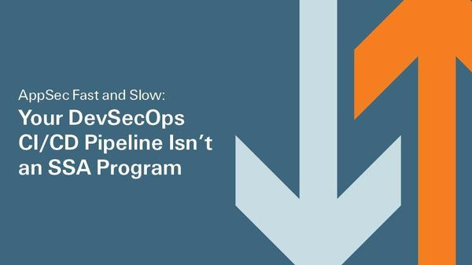
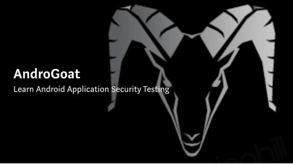
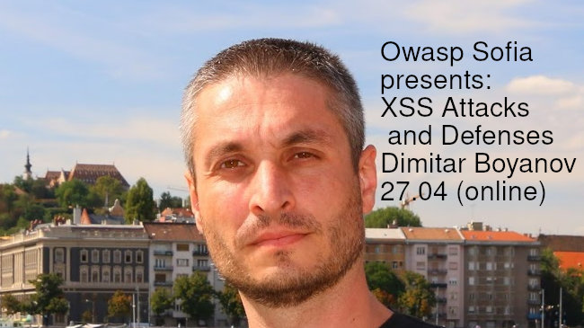
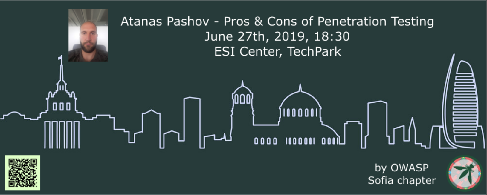
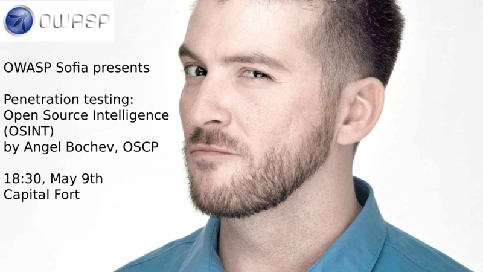

---

layout: col-sidebar
title: OWASP Sofia 
tags: sofia bulgaria

region: Europe
meetup-group: OWASP-Sofia-Chapter
country: Bulgaria
postal-code: 

---

This is the page of the OWASP Sofia chapter. An OWASP chapter is like a user group. We do events, discuss topics. And generally try to bring the security community together.

If you'd like to be a **part of our community**, want to **do a talk** or **sponsor** us, check out the [about](#about) page.

All our resources are located [here](#resources).

## 
OWASP 20th Anniversary Event

OWASP will be celebrating its [20th Anniversary](https://20thanniversary.owasp.org/) on September 24, 2021!  We will be hosting a live virtual 24-hour global event. [Registration](https://www.eventbrite.com/e/owasps-20th-anniversary-event-celebration-tickets-152915084133) is free for all to attend!

# 
Upcoming Events

### 
Check our Upcoming Meetup Events:


# 
Past Events

## 
AppSec Fast and Slow: Your DevSecOps CI/CD Pipeline Isn’t an SSA Program

OWASP Sofia is proud to invite you to join us and Dan Cornell, at the "AppSec Fast and Slow: Your DevSecOps CI/CD Pipeline Isn’t an SSA Program" session.

With all the focus on DevSecOps and integrating security into Continuous Integration/Continuous Delivery (CI/CD) pipelines, some teams may be lured into thinking that the entirety of a Software Security Assurance (SSA) program can be baked into these pipelines. While integrating security into CI/CD offers many benefits, it is critical to understand that a full SSA program encompasses a variety of activities – many of which are incompatible with run-time restrictions and other constraints imposed by these pipelines. This webinar looks at the breadth of activities involved in a mature SSA program and steps through the aspects of a program that can be realistically included in a pipeline, as well as those that cannot. It also reviews how these activities and related tooling have evolved over time as the application security discipline has matured and as development teams started to focus on cloud-native development techniques and technologies.

Speaker: Dan Cornell

A globally recognized software security expert, Dan Cornell has over 20 years of experience architecting, developing, and securing software systems. As Vice President of Product Strategy at Coalfire, Dan works with customers and industry partners to help drive the direction of their product portfolio. Prior to its acquisition by Coalfire, Dan was a founder of and the Chief Technology Officer at Denim Group, where he helped Fortune 500 companies and government organizations integrate security throughout the development process.

Cornell is an active member of the development community and a sought-after speaker on topics of application and software security, speaking at international conferences including RSA Security Conference, OWASP AppSec USA and EU, TEDx, and Black Hat Arsenal. He holds three patents in the area of software security.
[Presentation](https://speakerdeck.com/owaspsofia/owasp-sofia-dan-cornell-appsec-fast-and-slow-your-devsecops-ci-cd-pipeline-isnt-an-ssa-program-july-27th-2021),
[Video](https://youtu.be/Gx1_1Df_GAk)

## 
Understanding AWS cloud attacks using CloudGoat

**OWASP Sofia Chapter** is proud to present a session with Kavisha Sheth, who will talk about **AWS attacks** using CloudGoat.

Enterprises are increasingly running their IT and application infrastructure natively in the cloud. With more workloads running in the cloud, security becomes an important and unavoidable part of your day-to-day operations. All cloud providers seek to implement the shared responsibility of security with their customers, which means that although the cloud provider is responsible for the hardware and underlying infrastructure security, the customer becomes responsible for all accounts, workloads, systems, and configuration-based security.

Regardless of whether you are a cloud security enthusiast or a pentester, it is important that you are able to assess the security of the cloud platform and pentest these cloud-native deployments to help secure organizations. This session will help you get started and understand what are the different attacks that are possible on a target AWS environment. You will learn how to discover vulnerabilities and what attacks are possible on AWS that leverage AWS IAM, Lambda and S3, etc.

We will be using **CloudGoat** to demonstrate what these attacks look like. CloudGoat is an open-source Rhino Security Labs' "Vulnerable by Design'' AWS deployment tool. It allows you to hone your cloud cybersecurity skills by creating and completing several "capture-the-flag" style scenarios. We will be covering some of these scenarios to demonstrate AWS attacks. We will also include case studies from our assessments to highlight the real-world applicability of these attacks.

Speaker: **Kavisha Sheth**

Kavisha is a Security Analyst at Appsecco. She is a cloud security and machine learning enthusiast who dabbles in the application and API security and is passionate about helping customers in securing their IT assets. A member of a number of security communities including null community, InfoSecGirls, and WiCys India group. She believes in giving back to the community and frequently finds audiences to talk about Attacking GraphQL, different techniques to bypass authentication, and Attacking AWS.

When not breaking apps for Appsecco, Kavisha spends time findings vulnerabilities with bug bounty programs and has been recognized by the Government of India for helping them in securing their websites. She has also been listed as one of the top security researchers of the nation, in a recent newsletter of NCIIPC RVDP.

Kavisha has also earned a letter of appreciation from the Government of the United Kingdom for helping them in securing their website, and other organizations.

[Presentation TBD](),
[Video](https://youtu.be/yz8e60xkRj4)

## 
Learn Android application security testing using AndroGoat

**OWASP Sofia presents** a session by the author of AndroGoat.

AndroGoat is a purposely developed open-source vulnerable/insecure app using Kotlin. This app has a wide range of vulnerabilities related to certificate pinning, custom URL schemes, Android Network Security Configuration, WebViews, root detection, and over 20 other vulnerabilities. Security Testers/Professionals/Enthusiasts, Developers...etc. can use this application to understand and defend the vulnerabilities in the Android platform

Some of the vulnerabilities covered in the session:

- Network security config.xml related vulnerabilities
- Certificate pinning
- Firebase related vulnerabilities
- Unprotected android components

**Satish** is an Information Security Consultant, researcher, and blogger with 9+ years of experience in various areas of information security.
His areas of interest are Mobile and Cloud Security.

He developed a vulnerable android application using Kotlin – AndroGoat. This is the first ever vulnerable app developed using Kotlin. This will help Security Testers/Professionals/Enthusiasts, Developers...etc. to understand and defend the vulnerabilities in the Android platform.

He presented AndroGoat at Blackhat Europe 2020 event.

He will be talking about AndroGoat in this session.

For details about the speaker - https://twitter.com/satish_patnayak

[Presentation TBD](),
[Video](https://youtu.be/AEufQivw0sc)

## 
XSS Attacks and Defenses

**OWASP Sofia chapter** presents Dimitar Boyanov from Progress. In this session Dimitar will talk about XSS Attacks:

Attackers have weapons but defenders have strong armor. XSS is one of the most popular and dangerous attacks for web applications. All XSS types will be explained and defenses in-depth will be presented.

**Dimitar Boyanov** is a web developer with more than 15 years of experience. Leading developer and one of the founders of Sitefinity Security Team in Progress. Author of many defenses part of the leading CMS.

**Level**: Mid/Advanced Web Programming

**Meeting details**:
Mihail is inviting you to a scheduled Zoom meeting.

**Topic**: OWASP Sofia presents XSS Attacks and Defenses by Dimitar Boyanov
Time: Apr 27, 07:00 PM Sofia

## 
Compromising Modern Online Banking Apps through Hijacking Android Devices

(The talk will be in Bulgarian)

**Live Demo: Compromising Modern Online Banking Apps through Hijacking Android Devices**

In this talk Dr. Svetlin Nakov will explain and demonstrate how easily a 10-years old child can gain full control over modern European online banking apps, through hijacking an Android mobile phone, using trivial remote administration tools and screen recording apps from the official Android app store. The speaker will demonstrate why online banking should not rely for the multi-factor authentication on a single connected device. Finally, the speaker will give recommendations for fixing the security in online banking systems.

Dr. Svetlin Nakov (https://nakov.com) is a passionate software engineer, inspirational technical trainer and tech entrepreneur, with 20 years of experience in a broad range of programming languages, software technologies and platforms, applied cryptography and cybersecurity. He is an author of the "Practical Cryptography for Developers" book (https://cryptobook.nakov.com). Svetlin is co-founder of several highly successful tech startups and non-profit organizations. Currently, he is innovation and inspiration manager at SoftUni (https://softuni.org) - the largest tech education provider in South-Eastern Europe.

[Presentation](https://speakerdeck.com/owaspsofia/owasp-sofia-svetlin-nakov-compromising-modern-online-banking-apps-through-hijacking-android-device-27th-of-march-2021)

## 
Pros & Cons of Penetration Testing (June 27th, 2019)

In this session you will learn what is penetration testing. What are the objectives and benefits of it and at what cost. You will also learn why some vulnerabilities may not be ever discovered by automated tools. You will see only real life examples from real penetration tests, no theory, no set-ups, no fictious vulnerabilities, nothing discovered by somebody else that you can find somewhere else.

Atanas Pashov is a cloud security penetration tester at SAP LAB Bulgaria. He has more than 10 years experience in information security working in various position as an infosec manager, security officer and network and firewall administrator for huge enterprise companies in different industries like banking, service providers, pharmaceuticals and software development. He is keen on pentesting especially in infrastructure and web application perspective.

Venue, food by [ESI CEE](https://esicenter.bg/)

Beer by [STY](https://sty.bz/)

[Presentation](https://speakerdeck.com/owaspsofia/owasp-sofia-atanas-pashov-pros-n-cons-of-penetration-testing-june-27th-2019),
No Video

Pictures, attendance, comments: [Meetup event](https://www.meetup.com/OWASP-Sofia-Chapter/events/261105250/)

## 
Penetration Testing: OSINT (May 9th, 2019)

A real-world pentester talks about OSINT - Open Source Intelligence - the exploration of various techniques and tools for one of the most important parts of every penetration test - the information gathering.

Angel Bochev is Offensive Security Certified Professional (OSCP) since 2016; is a CTF player; has 12+ years of networking/sysadmin experience; currently working in the InfoSec team at PROS.

Venue, beer and food by [Paysafe](https://paysafe.com).

[Presentation](https://speakerdeck.com/owaspsofia/owasp-sofia-angel-bochev-penetration-testing-osint-may-9th-2019),
[Video](https://www.youtube.com/watch?v=KIVSeSNGKSA)

Pictures, attendance, comments: [Meetup event](https://www.meetup.com/OWASP-Sofia-Chapter/events/261105250/)
