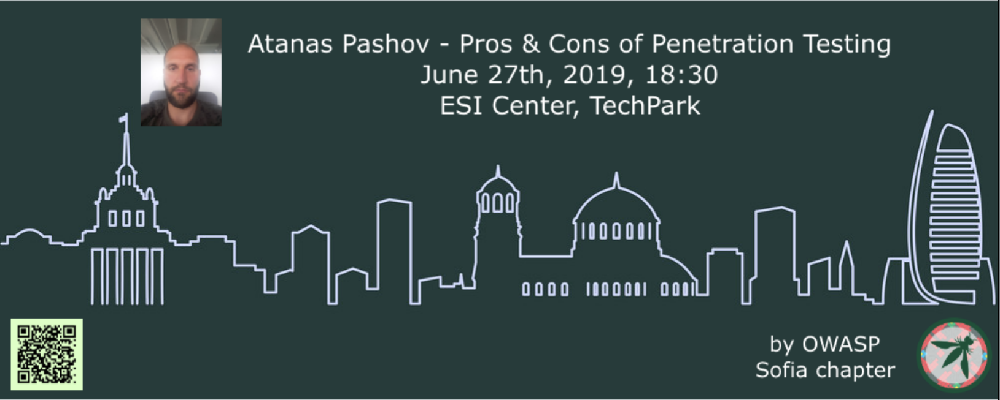
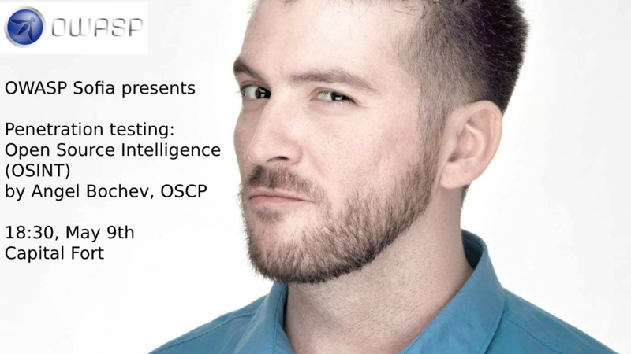

---

layout: col-sidebar
title: OWASP Sofia Chapter
tags: sofia bulgaria

region: Europe

---

This is the page of the OWASP Sofia Chapter. An OWASP Chapter is like a user group. We do events, discuss topics.

If you'd like to be a **part of our community**, want to **do a talk** or **sponsor** us, check out the [about](#about) page.

All our resources are located [here](#resources).

## Past Events

For **future events**, check the [meetup](https://www.meetup.com/OWASP-Sofia-Chapter/) page.

### Atanas Pashov - Pros & Cons of Penetration Testing (June 27th, 2019)

In this session you will learn what is penetration testing. What are the objectives and benefits of it and at what cost. You will also learn why some vulnerabilities may not be ever discovered by automated tools. You will see only real life examples from real penetration tests, no theory, no set-ups, no fictious vulnerabilities, nothing discovered by somebody else that you can find somewhere else.

Atanas is a cloud security penetration tester at SAP LAB Bulgaria. He has more than 10 years experience in information security working in various position as an infosec manager, security officer and network and firewall administrator for huge enterprise companies in different industries like banking, service providers, pharmaceuticals and software development. He is keen on pentesting especially in infrastructure and web application perspective.

Venue, food by [ESI CEE](https://esicenter.bg/)

Beer by [STY](https://sty.bz/)

[Presentation](https://speakerdeck.com/owaspsofia/owasp-sofia-atanas-pashov-pros-n-cons-of-penetration-testing-june-27th-2019),
No Video

Pictures, attendance, comments: [Meetup event](https://www.meetup.com/OWASP-Sofia-Chapter/events/261105250/)

### Session: Angel Bochev - Penetration Testing: OSINT (May 9th, 2019)

A real-world pentester talks about OSINT - Open Source Intelligence - the exploration of various techniques and tools for one of the most important parts of every penetration test - the information gathering.

Angel Bochev is Offensive Security Certified Professional (OSCP) since 2016; is a CTF player; has 12+ years of networking/sysadmin experience; currently working in the InfoSec team at PROS.

Venue, beer and food by [Paysafe](https://paysafe.com).

[Presentation](https://speakerdeck.com/owaspsofia/owasp-sofia-angel-bochev-penetration-testing-osint-may-9th-2019),
[Video](https://www.youtube.com/watch?v=KIVSeSNGKSA)

Pictures, attendance, comments: [Meetup event](https://www.meetup.com/OWASP-Sofia-Chapter/events/261105250/)

