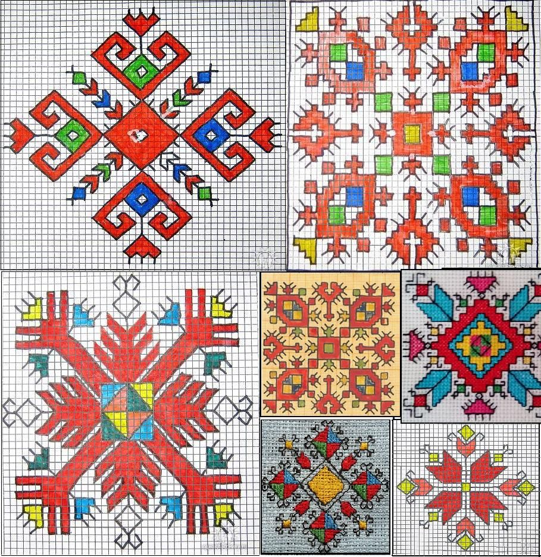

We're one of the youngest chapters. Since we're the first in Bulgaria, we expect to grow quickly.

## Join our community?

Currently we use [Meetup](https://www.meetup.com/OWASP-Sofia-Chapter/) as a place to talk about owasp related stuff.

If there's critical mass of people, we might set up a slack channel.

## Share your conference room?

Are you a local company that would like to share your conference room for an event? Please [contact us](mailto:mihail.stoynov@owasp.org).

Attendance is still small. The ballpark figure is 20-30 people.

## Do a talk?

Do you have an interesting topic and would like to share? If you're interested in speaking or would like to share your expertise, please [contact us](mailto:mihail.stoynov@owasp.org).

Keep in mind that our meetings are still small and very welcoming so there's no pressure if you want to speak for a first time or feel unsure on the topic.

## Sponsor us?

Are a company that would like to sponsor us? We use the money to buy food/beer or pay for travel/accomodation expenses when we invite non-local speakers.

Please [contact us](mailto:mihail.stoynov@owasp.org).

## Logo

The background is a traditional Bulgarian embroidery called [Шевица](https://bg.wikipedia.org/wiki/Шевица) or more concretely [Елбетица](https://duckduckgo.com/?q=bulgarian+embroidery+elbetica&iax=images&ia=images).

### Symbolism 

Symbolizes harmony. The two crosses depict the four cardinal directions and their combinations (N, S, E, W, NW, NE, SW, SE) that meet in a "strong" center. The second meaning is that the cross depicts the four weather seasons common in Bulgaria.

Sofia chapter logo designed by Desi.
