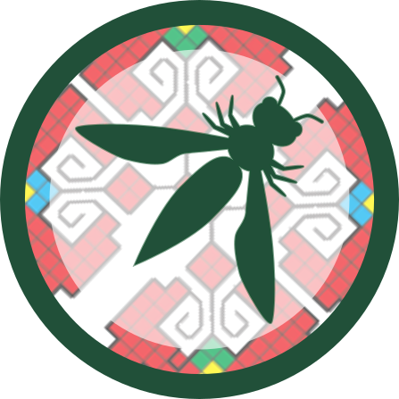

# 2019 - 2022

We extend our heartfelt gratitude to the previous leaders of the OWASP Sofia Chapter who guided our community from 2019 to 2022. Their dedication and hard work laid a strong foundation for our ongoing efforts to enhance cybersecurity awareness and education in Bulgaria.

## Past leadership

* [Mihail Stoynov](mailto:mihail.stoynov@owasp.org)
* [Peter Peshev](mailto:peter.peshev@owasp.org)

## Past logo

The background is a traditional Bulgarian embroidery called [Шевица](https://bg.wikipedia.org/wiki/Шевица) or more concretely [Елбетица](https://duckduckgo.com/?q=bulgarian+embroidery+elbetica&iax=images&ia=images).

#### Symbolism

Symbolizes harmony. The two crosses depict the four cardinal directions and their combinations (N, S, E, W, NW, NE, SW, SE) that meet in a "strong" center. The second meaning is that the cross depicts the four weather seasons common in Bulgaria.

Sofia chapter logo designed by Desi.

## Past events

### 2022

* `28.06.2022` \| "**Why hackers love Javascript?**" \| *Martin Stoynov*
  
### 2021

* `31.07.2021` \| "**AppSec Fast and Slow: Your DevSecOps CI/CD Pipeline Isn’t an SSA Program**" \| *Dan Cornell*
  * [video](https://www.youtube.com/watch?v=Gx1_1Df_GAk) \| [slides](https://speakerdeck.com/owaspsofia/owasp-sofia-dan-cornell-appsec-fast-and-slow-your-devsecops-ci-cd-pipeline-isnt-an-ssa-program-july-27th-2021)

* `21.07.2021` \| **Understanding AWS cloud attacks using CloudGoat** \| *Kavisha Sheth*
  * [video](https://www.youtube.com/watch?v=yz8e60xkRj4)

* `21.07.2021` \| **Learn Android application security testing using AndroGoat** \| *Satish Patnayak*
  * [video](https://www.youtube.com/watch?v=AEufQivw0sc)

* `27.04.2021` \| **XSS Attacks and Defenses** \| *Dimitar Boyanov*
  * [video](https://www.youtube.com/watch?v=z6y1KBxgFLM) \| [slides](https://speakerdeck.com/owaspsofia/owasp-sofia-dimitar-boyanov-xss-attacks-and-defenses-27th-of-april-2021)

* `27.03.2021` \| **Compromising Modern Online Banking Apps through Hijacking Android Devices** \| *Dr. Svetlin Nakov*
  * [slides](https://speakerdeck.com/owaspsofia/owasp-sofia-svetlin-nakov-compromising-modern-online-banking-apps-through-hijacking-android-device-27th-of-march-2021)

### 2019

* `27.06.2019` \| **Pros & Cons of Penetration Testing** \| *Atanas Pashov*
  * [slides](https://speakerdeck.com/owaspsofia/owasp-sofia-atanas-pashov-pros-n-cons-of-penetration-testing-june-27th-2019)

* `09.05.2019` \| **Penetration Testing: OSINT** \| *Angel Bochev*
  * [video](https://www.youtube.com/watch?v=KIVSeSNGKSA) \| [slides](https://speakerdeck.com/owaspsofia/owasp-sofia-angel-bochev-penetration-testing-osint-may-9th-2019)
